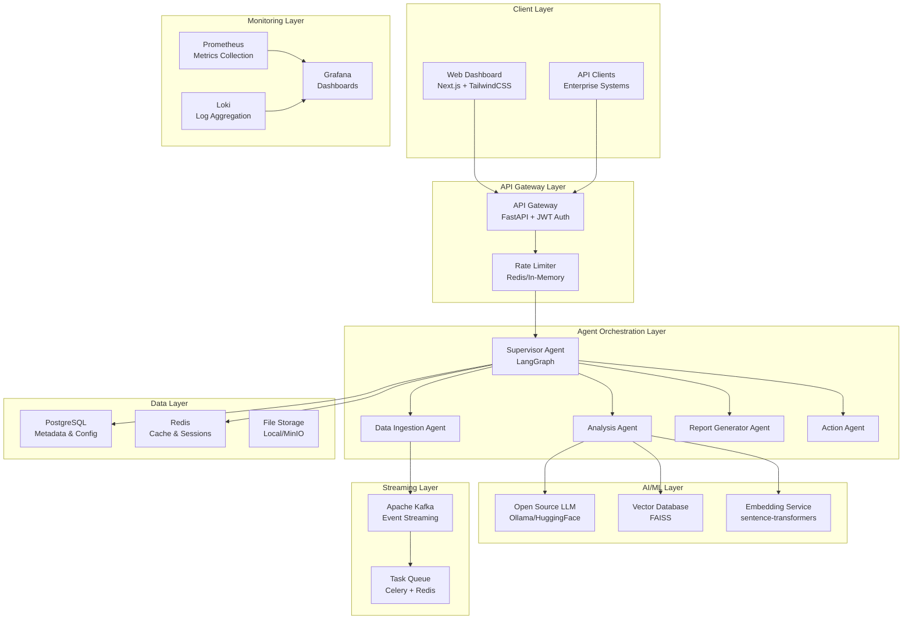
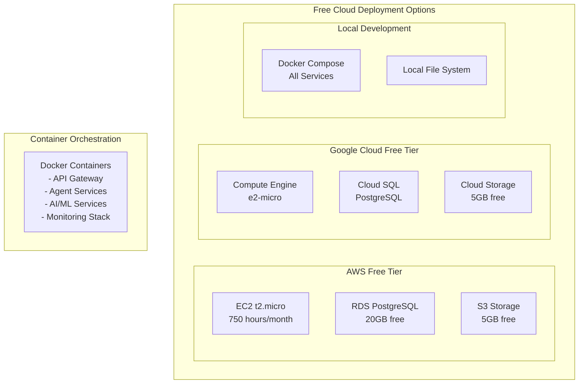

# Design Document

## Overview

The Enterprise Multi-Agent AI Workflow Automation Platform is designed as a microservices-based system that leverages free and open-source technologies to deliver enterprise-grade AI workflow automation. The platform uses LangGraph for agent orchestration, FAISS for vector storage, open-source LLMs via Ollama, and can be deployed on free cloud tiers or locally.

The system follows an event-driven architecture where specialized AI agents collaborate to process business workflows autonomously, with comprehensive monitoring and multi-tenant isolation built using entirely free technologies.

## Architecture

### High-Level Architecture



### Deployment Architecture



## Components and Interfaces

### 1. API Gateway Service

**Technology**: FastAPI with JWT authentication
**Responsibilities**:

- Request routing and load balancing
- Authentication and authorization
- Rate limiting (using Redis or in-memory store)
- Request/response logging
- Multi-tenant request isolation

**Key Interfaces**:

```python
# Authentication
POST /auth/login
POST /auth/refresh
GET /auth/verify

# Workflow Management
POST /workflows/execute
GET /workflows/{workflow_id}/status
GET /workflows/{workflow_id}/logs

# Agent Management
GET /agents/status
POST /agents/{agent_type}/trigger
```

### 2. Supervisor Agent Service

**Technology**: LangGraph + FastAPI
**Responsibilities**:

- Workflow orchestration and state management
- Agent coordination and communication
- Error handling and retry logic
- Progress tracking and reporting

**Agent Communication Protocol**:

```python
class AgentMessage:
    agent_id: str
    workflow_id: str
    task_type: str
    payload: Dict[str, Any]
    priority: int
    timestamp: datetime
```

### 3. Data Ingestion Agent

**Technology**: Python + Apache Kafka
**Responsibilities**:

- Email attachment processing (IMAP/POP3)
- ERP system integration (REST APIs)
- File format conversion (PDF, DOCX, CSV, etc.)
- Data validation and preprocessing

**Supported Integrations**:

- Email servers (Gmail API, IMAP)
- REST APIs (generic webhook support)
- File uploads via web interface
- FTP/SFTP connections

### 4. Analysis Agent

**Technology**: LangGraph + FAISS + Open-source LLM
**Responsibilities**:

- Document embedding generation
- Semantic search and retrieval
- Context-aware response generation
- Metadata extraction and tagging

**RAG Pipeline**:

```python
class RAGPipeline:
    def __init__(self):
        self.embeddings = SentenceTransformer('all-MiniLM-L6-v2')
        self.vector_store = FAISS()
        self.llm = OllamaLLM(model='llama3.1')

    def process_document(self, document: str) -> None:
        # Chunk, embed, and store document
        pass

    def query(self, question: str) -> str:
        # Retrieve relevant chunks and generate response
        pass
```

### 5. Report Generator Agent

**Technology**: Python + ReportLab (PDF) + openpyxl (Excel)
**Responsibilities**:

- Template-based report generation
- Data visualization (matplotlib/plotly)
- Multi-format output (PDF, Excel, CSV)
- Custom branding and styling

### 6. Action Agent

**Technology**: Python + HTTP clients
**Responsibilities**:

- CRM system updates (Salesforce, HubSpot APIs)
- Issue tracking integration (Jira, GitHub Issues)
- Email notifications (SMTP)
- Webhook notifications

### 7. Vector Database Service

**Technology**: FAISS with persistence layer
**Responsibilities**:

- High-performance vector similarity search
- Document chunk storage and retrieval
- Metadata filtering and indexing
- Backup and recovery

**FAISS Configuration**:

```python
class VectorStore:
    def __init__(self):
        self.dimension = 384  # sentence-transformers dimension
        self.index = faiss.IndexFlatIP(self.dimension)
        self.metadata_store = {}  # Document metadata

    def add_documents(self, embeddings, metadata):
        self.index.add(embeddings)
        # Store metadata separately

    def search(self, query_embedding, k=10):
        scores, indices = self.index.search(query_embedding, k)
        return self._get_documents_by_indices(indices)
```

### 8. LLM Service

**Technology**: Ollama or Hugging Face Transformers
**Responsibilities**:

- Text generation and completion
- Question answering
- Document summarization
- Content extraction

**Model Options**:

- **Ollama**: llama3.1, mistral, codellama (local deployment)
- **Hugging Face**: microsoft/DialoGPT, google/flan-t5-large
- **Custom fine-tuning**: Using LoRA for domain-specific tasks

## Data Models

### Core Entities

```python
from sqlalchemy import Column, Integer, String, DateTime, JSON, ForeignKey
from sqlalchemy.ext.declarative import declarative_base

Base = declarative_base()

class Tenant(Base):
    __tablename__ = 'tenants'

    id = Column(Integer, primary_key=True)
    name = Column(String(255), nullable=False)
    api_key = Column(String(255), unique=True)
    created_at = Column(DateTime)
    config = Column(JSON)  # Tenant-specific configuration

class Workflow(Base):
    __tablename__ = 'workflows'

    id = Column(Integer, primary_key=True)
    tenant_id = Column(Integer, ForeignKey('tenants.id'))
    name = Column(String(255))
    status = Column(String(50))  # pending, running, completed, failed
    config = Column(JSON)
    created_at = Column(DateTime)
    completed_at = Column(DateTime)

class Document(Base):
    __tablename__ = 'documents'

    id = Column(Integer, primary_key=True)
    tenant_id = Column(Integer, ForeignKey('tenants.id'))
    workflow_id = Column(Integer, ForeignKey('workflows.id'))
    filename = Column(String(255))
    content_type = Column(String(100))
    file_path = Column(String(500))
    metadata = Column(JSON)
    processed_at = Column(DateTime)

class AgentTask(Base):
    __tablename__ = 'agent_tasks'

    id = Column(Integer, primary_key=True)
    workflow_id = Column(Integer, ForeignKey('workflows.id'))
    agent_type = Column(String(100))
    status = Column(String(50))
    input_data = Column(JSON)
    output_data = Column(JSON)
    error_message = Column(String(1000))
    started_at = Column(DateTime)
    completed_at = Column(DateTime)
```

### Vector Storage Schema

```python
class DocumentChunk:
    chunk_id: str
    document_id: str
    tenant_id: str
    content: str
    embedding: List[float]
    metadata: Dict[str, Any]
    chunk_index: int

class VectorMetadata:
    document_type: str
    source: str
    created_date: datetime
    tags: List[str]
    confidence_score: float
```

## Error Handling

### Error Categories and Responses

1. **Authentication Errors**

   - Invalid JWT tokens → 401 Unauthorized
   - Expired tokens → 401 with refresh instruction
   - Rate limit exceeded → 429 Too Many Requests

2. **Agent Execution Errors**

   - LLM service unavailable → Retry with exponential backoff
   - Vector database timeout → Fallback to cached results
   - External API failures → Queue for retry with circuit breaker

3. **Data Processing Errors**
   - Unsupported file formats → Return error with supported formats list
   - Corrupted files → Log error and skip processing
   - Memory limitations → Implement chunked processing

### Retry and Circuit Breaker Strategy

```python
from tenacity import retry, stop_after_attempt, wait_exponential
import circuit_breaker

class AgentService:
    @retry(
        stop=stop_after_attempt(3),
        wait=wait_exponential(multiplier=1, min=4, max=10)
    )
    async def call_llm_service(self, prompt: str):
        # LLM service call with retry logic
        pass

    @circuit_breaker.circuit(failure_threshold=5, recovery_timeout=30)
    async def call_external_api(self, endpoint: str, data: dict):
        # External API call with circuit breaker
        pass
```

## Testing Strategy

### 1. Unit Testing

- **Framework**: pytest + pytest-asyncio
- **Coverage**: All agent services, data models, utility functions
- **Mocking**: External APIs, LLM responses, database operations

### 2. Integration Testing

- **Agent Communication**: Test message passing between agents
- **Database Operations**: Test CRUD operations with test database
- **API Endpoints**: Test all REST endpoints with different scenarios

### 3. End-to-End Testing

- **Workflow Execution**: Complete workflow from document upload to report generation
- **Multi-tenant Isolation**: Verify tenant data separation
- **Performance Testing**: Load testing with multiple concurrent workflows

### 4. AI/ML Testing

- **RAG Pipeline**: Test document retrieval accuracy
- **LLM Responses**: Validate response quality and relevance
- **Vector Search**: Test embedding similarity and search performance

### Test Environment Setup

```python
# conftest.py
import pytest
from fastapi.testclient import TestClient
from sqlalchemy import create_engine
from sqlalchemy.orm import sessionmaker

@pytest.fixture
def test_db():
    engine = create_engine("sqlite:///./test.db")
    TestingSessionLocal = sessionmaker(bind=engine)
    Base.metadata.create_all(bind=engine)

    db = TestingSessionLocal()
    try:
        yield db
    finally:
        db.close()
        Base.metadata.drop_all(bind=engine)

@pytest.fixture
def client():
    from main import app
    return TestClient(app)

@pytest.fixture
def mock_llm():
    # Mock LLM responses for consistent testing
    pass
```

### Performance Benchmarks

- **Document Processing**: < 5 seconds per document
- **Vector Search**: < 100ms for similarity search
- **API Response Time**: < 2 seconds for most endpoints
- **Concurrent Users**: Support 50+ concurrent workflows on free tier resources

## Security Considerations

### Authentication and Authorization

- JWT tokens with 1-hour expiration
- Refresh tokens with 7-day expiration
- Role-based access control (RBAC)
- API key authentication for external integrations

### Data Protection

- Encryption at rest using SQLCipher for SQLite or built-in encryption for PostgreSQL
- TLS 1.3 for all API communications
- Input validation and sanitization
- SQL injection prevention using parameterized queries

### Multi-tenant Security

- Tenant ID validation on all database queries
- Isolated file storage per tenant
- Network-level isolation in containerized deployment
- Audit logging for all tenant operations

This design provides a comprehensive, enterprise-grade AI workflow automation platform using entirely free and open-source technologies, capable of running on free cloud tiers while maintaining scalability and security standards.
